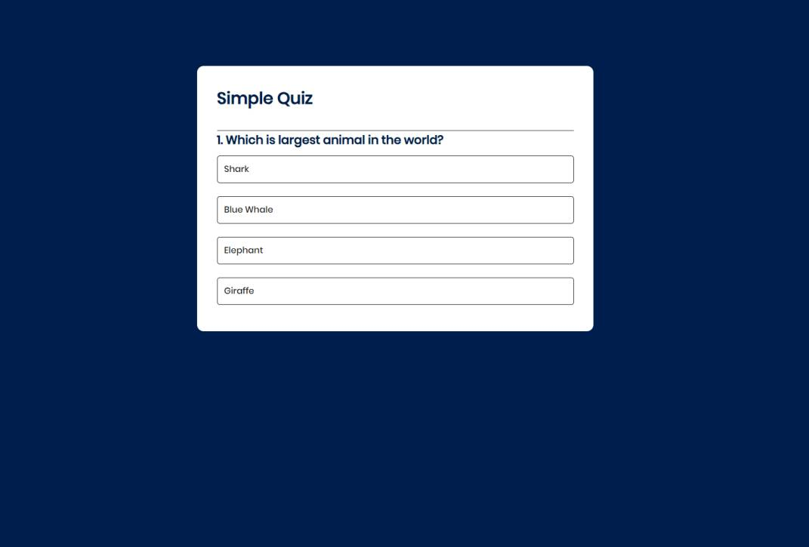

# :closed_book: Quiz App

### _Quiz web using js !!_

### Link :link: https://rak-quiz.netlify.app/

## Interface

## Run Locally

  - Run This command `https://github.com/developer-rak/Quiz-App.git`
  - You are now in the dev environment and you can play around

## ✨ Features

  - Select any type of answer it will be show right or wrong answer

## ⚙️ Tech Stack
  - HTML5
  - CSS
  - JavaScript
  - Netlify
